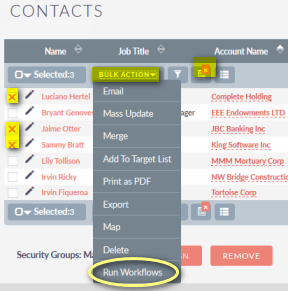

### Somewhere between automatic and manual, there lies **Productivity**...

In SuiteCRM, with Workflows you can automatically react to an event. 
You can also have Workflows go over all your records in a certain module. Meanwhile, your users 
work on manually reviewing and actioning other things in the CRM.

When these manual things are laborious and repetitive, waste your Users' time, and are prone 
to manual error, that's when you feel the need for something more.

Workflows are a great way to define a sequence of actions to apply on a record, all from 
a graphical UI. If only it was easier to trigger them right there, on the spot, when looking at
a record...

### Workflows you can trigger manually from Views!

So, [my sponsors on Github](https://github.com/sponsors/pgorod) get access to this great add-on 
which will greatly increase the power of SuiteCRM. This will convert to happier users and 
saved money in your organization, in no time.

While setting up a Workflow, you get a new option in the **Run** dropdown:

This marks the Workflow as something that will not be run when some scheduler runs, 
or when some record is changed, but rather **when a user decides** to run it on a record she 
has on the screen in front of her.

(Note that, counter-intuitively, **Always** won't activate the Workflow buttons we're describing here - you 
have to select the specific option as seen in the screenshot above.)  

### Run Workflows from the Detail view action buttons

In each record (any kind, including custom modules), you will get a new **Action button** 
called **Run Workflows** on the top. Here we show the menu as separate buttons, but it's
also there if your System Settings define it's a dropdown menu instead.

Pressing that button will invoke all Workflows with these characteristics, on the current record:
* marked as Active
* applicable to the current module
* marked as **From User Actions in Views** in the **Run** dropdown
* the conditions on the Workflow evaluate to true for the current record

### Run Workflows from any Sub-panel in Detail views

Also in the Detail view, when you scroll down to the subpanels area, you also get a new action
button for each related record listed.  

This is another great time-saver. You don't even have to go into that related record 
to trigger the Workflows. You can do it directly as soon as you see it in any subpanel.

So, for example, you can be in a **Contact** and trigger an action on a related **Case**, 
or **Task**, etc.

### Run Workflows from List views - more than one at once!

In the List Views you get an additional power. Since the **Run Workflows** option is placed
inside the **Bulk Actions** menu, that means you can trigger Workflows for many records at once!  

In this screenshot, you can see I have a Filter applied, then selected 3 specific records, then I'm
launching the Workflows from the **Bulk Actions** dropdown.

The Filters function is powerful and combines very well with this add-on. You can use saved filters,
combine several fields in the search, and then further drill down by selecting a few records manually.
Remember the **conditions** inside the Workflow will also be taken into account, in case you prefer to do it
from there.

Just imagine the possibilities! Select a bunch of records and have a Workflow create individual **Calls** 
for each of them. Or have a Workflow use a Calculated Field to update some field inside them with
new information from a related record. Or send an email to that record, based on a template, without 
going into each record individually.

Note that this is **limited to the selected records visible on each list page**. If you're looking at a 
list view with 1,000 records, select all, and trigger the Workflows, they will only 
run for the 20 that are showing on the first page. Even with this restriction, be careful 
with **performance** - as you add too many records, it gets awkward to have the page waiting 
for 20 or 30 seconds while they execute. The mechanism needs to applied reasonably, especially
with Workflows that take a long time!
 
