SuiteCRM Workflows are powerful, but some of the available options can be confusing for new users. 
I'll try and breakdown some of the elements that determine when and how a workflow runs. 

This is written as more advanced tutorial, so it assumes you already had a look at the [existing
documentation](https://docs.suitecrm.com/user/advanced-modules/workflow/). 

## When does it run?

### Requirements for each kind of Workflow to be triggered

To clarify and facilitate troubleshooting, I've laid out every possible combination of the option 
that affect when Workflows are triggered. Then I can explain each one. 

| Settings | Cron | Bean Action | First Run | 
| ------ | :-----: | :---: | :---: | 
| 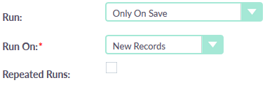    |      | New      | ✅ | 
| 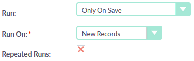  |      | New      |    | 
| 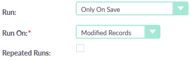    |      | Edit     | ✅ | 
| 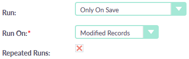  |      | Edit     |    | 
| 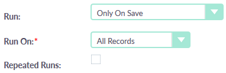    |      | Edit+New | ✅ | 
| 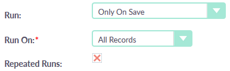  |      | Edit+New |    | 
| 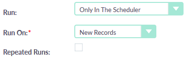  | ✅   | New      | ✅ | 
| 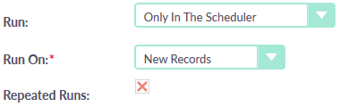| ✅   | New      |    | 
| 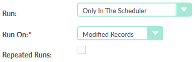  | ✅   | Edit     | ✅ | 
| 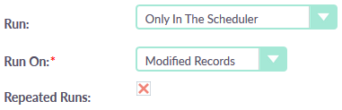| ✅   | Edit     |    | 
| 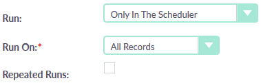  | ✅   | Edit+New | ✅ | 
| 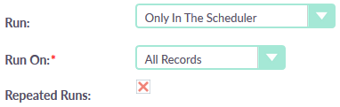| ✅   | Edit+New |    | 
| 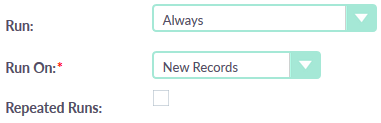      | (✅) | New      | ✅ | 
| 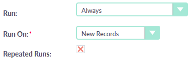    | (✅) | New      |    | 
| 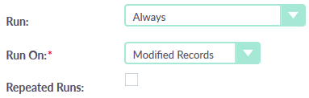      | (✅) | Edit     | ✅ | 
| 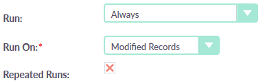    | (✅) | Edit     |    | 
| 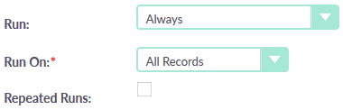      | (✅) | Edit+New | ✅ | 
| 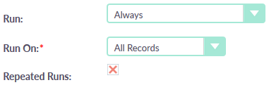    | (✅) | Edit+New |    | 

**All** of the mentioned conditions must be met in order for the Workflow to be successfully triggered.

An **additional condition** that applies to all Workflows is that they only run if their
**`Status`** is set to **`Active`**.
 
#### Cron Requirement

For this requirement, your Scheduler jobs must be getting executed, after a successful configuration. 
You can check they are running in **Admin / Schedulers / Run AOW Workflows job**. Go into that job and 
have a look at the **`Last ran successfully`** field. Has it run recently? Is that time in the correct timezone?

If you need to troubleshoot this, have a look at this article I wrote: 
[Scheduler Jobs in SuiteCRM in Linux - the Definitive Guide ](https://docs.suitecrm.com/blog/scheduler-jobs/)

* ✅ means that a cron job needs to run for the specified Workflow to be triggered.

* (✅) means that a cron job needs to run for the specified Workflow to be triggered, but the Workflow 
might also be triggered in a different way, through a bean action.

#### Bean Action Requirement

Some user takes an action inside a record **of the Workflow's defined module**.

* **New** means this action is creating a new record.

* **Edit** means this action is editing an existing record, either through an edit view or an inline edit.

* **Edit+New** means this action is any of the two explained above.
 
* **Indirect actions**: sometimes these changes are not directly done by a user, or not directly in that module.
It's common for records to be changed as side effects of other things going on in the CRM. _Some_ of these 
other actions that change a record "under the hood" will also trigger the Workflow. This depends on whether 
the developer of that feature included a workflow check with his action; normally it will, since the changes 
are done through the Bean object, which takes care of this.

#### First Run Requirement  

The specified Workflow will only run if this is the first time it is being triggered for the same record.
So the Workflow can be triggered many times, but only if applied to different records.

The history of each Workflow and execution for specific records is saved in the `aow_processed` table.

### More and Better Ways to Trigger SuiteCRM Workflows

Workflows would be so much more powerful if you could set them up as tasks to be invoked fron anywhere in 
SuiteCRM. That's exactly what my [PowerWorkflows](/power-workflows) add-on does.

The main criteria that this adds is _user discretion_. A human being deciding that the Workflow should run 
**_now_**, for **_this_** record.